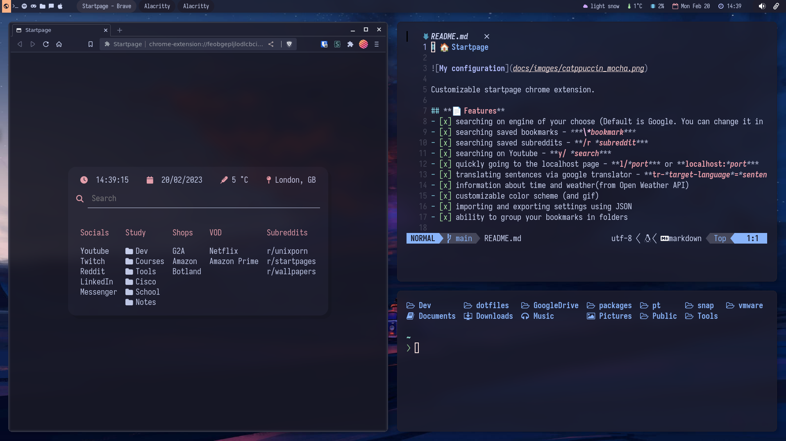
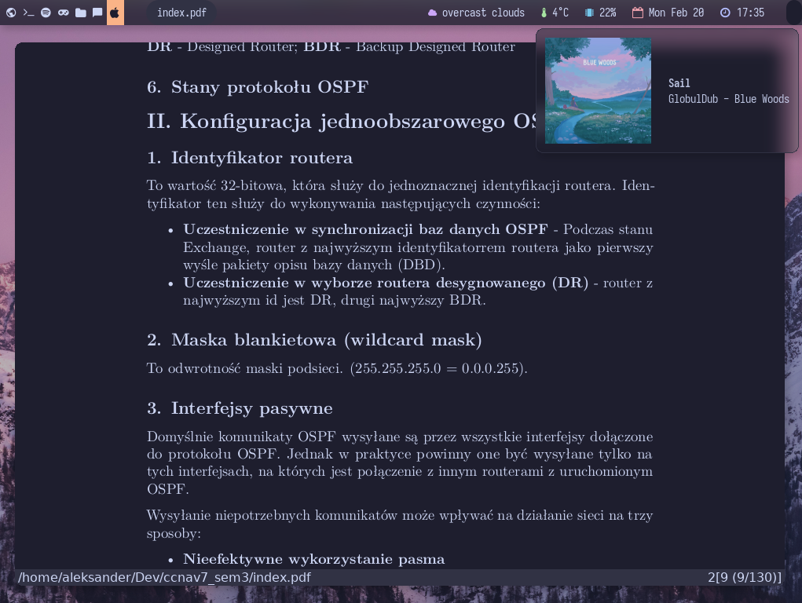

# 📁  Dotfiles

This is repo for my 🐧 **Linux dotfiles**.

## 📦 Software

- **Awesome WM**
- **Alacritty**
- **Rofi**
- **Brave with [my Startpage extension](https://github.com/jozwikaleksander/startpage)**
- **Picom**
- **Neovim**
- **Zsh**
- **Starship**
- **Nitrogen**
- **Clipman**
- **Zathura**

## 🎨 Color scheme
In this configuration I am using [Catppuccin Mocha](https://github.com/catppuccin/catppuccin).

## 📸 Screenshots

## 👤 Credits
This project was made by **Aleksander Jóźwik** ([@jozwikaleksander](https://github.com/jozwikaleksander)).
